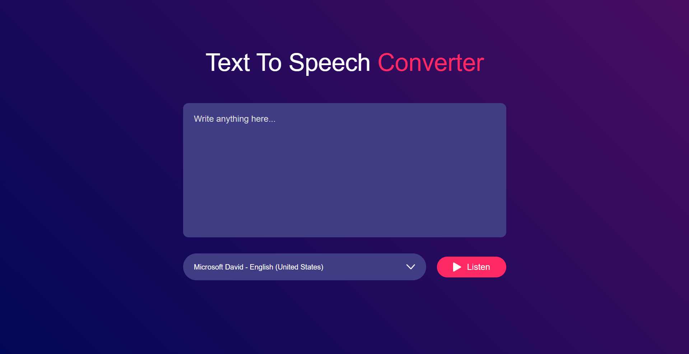

# 🗣️ Text to Speech Converter

A simple **Text to Speech Converter** built using **HTML, CSS, and JavaScript**.  
It uses the **Web Speech API** to convert written text into spoken words with multiple voice options.

---

## 🚀 Features
- Convert any text to speech in real-time.
- Choose from multiple available voices.
- Clean and responsive UI with gradient design.
- Play button with icon for better UX.

---

## 📂 Project Structure
```
text-to-speech-converter/
│── index.html       # Main HTML file
│── style.css        # Styling
│── script.js        # Functionality
│── images/          # Icons & Screenshots
│    ├── play.png
│    ├── dropdown.png
│    ├── screenshot1.png
│    └── screenshot2.png

```

---

## ⚡ Installation & Usage
1. Clone the repository:
   ```bash
   git clone https://github.com/<your-username>/text-to-speech-converter.git
   cd text-to-speech-converter
2. Open index.html in your browser.
That’s it! 🎉
---

## 🖼️ Screenshots

  


---

### 🛠️ Technologies Used

- HTML5

- CSS3

 - JavaScript (Web Speech API)

---

### 🤝 Contributing

Contributions, issues, and feature requests are welcome!
Feel free to fork this repo and submit a pull request.
